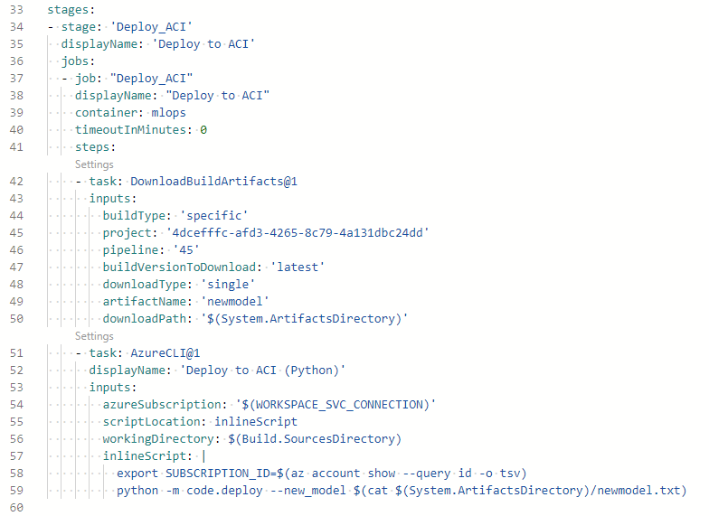

# Getting Started
Follow the tutorial [here](https://github.com/microsoft/MLOpsPython/blob/master/docs/getting_started.md) until the **Create an Azure DevOps Service Connection for the Azure ML Workspace** step. The required .yml file can be found in this repository.

## First Data Ingestion
Run YS-First-Ingestion.yml the same way the environment setup was done. This pipeline will run a Python script which registers two datasets: aviation_main.csv and aviation_inflow.csv, both of which can be found under the data subfolder. 

## Continuous Integration
Next, run YS-CI.yml the same way as above. This pipeline will cycle the data, simulating new data inflow into our dataset, and retrains the model. The data cycling updates both datasets, the main and the inflow, allowing for an infinite number of runs. If the new model has a higher accuracy, then it is registered appended as a new version of the model. Regardless, a build artifact will be published, with either a y or n, depending on whether a new model is registered. 

*The first run will always return y.*

## Continuous Deployment
Now, create the CD pipeline using YS-CD.yml, but during the Review step, go to line 43 and click on 'Show Assistant'. Then, find 'Download build artifacts', click on 'Specific build', and select the current project. For 'Build pipeline', select the CI pipeline created and run on the previous step. Then, under 'Artifact name', type 'newmodel', without the quotes. Make sure that the indentation of the new block of code is two tabs in, or four spaces. This will tell the CD pipeline to look at the specific CI pipeline to look for the artifact, which tells the CD pipeline whether to update the model or not. Now, we are able to run this pipeline. The body of the .yml file should look like this:

This pipeline will deploy our registered model to ACI, which will allow us to make inferences using an endpoint URI. The URI will be printed in the "Deploy to ACI (Python)" step of the pipeline, and can also be found under Endpoints in Azure Machine Learning portal. As better models are registered, this URI will stay put, while serving the latest version of the model.

## Flask Deployment
Replace the scoring_uri variable in Flask's app.py with the URI generated from the previous step. With Azure App Services extension installed in VSC, click on "Create New Web App...", name your app, and allow it to deploy. It may take a while, but once it is done, the generated web app will allow users to make inferences with the latest version of this model.

### Run Scheduling
Currently, the CI pipeline runs at 2.25PM GMT+8 everyday. This timing can be changed in YS-CI.yml, following the cron time format in GMT.

### Other Notes
Unfortunately, there are some inconveniences when it comes to using pipelines. First of all, simply knowing Python is insufficient to get these pipelines going. You may use pipeline steps generated by Azure Pipelines, but knowing to customize them requires some .yml knowledge. 

Knowing bash and CLI commands are a huge plus, as working in mostly bash and CLI is much more robust than working on Python.

Transferring information from one pipeline to another is also quite troublesome, as you would have to publish a build artifact in one pipeline, download the build artifact in another pipeline, and read the variable from there. 